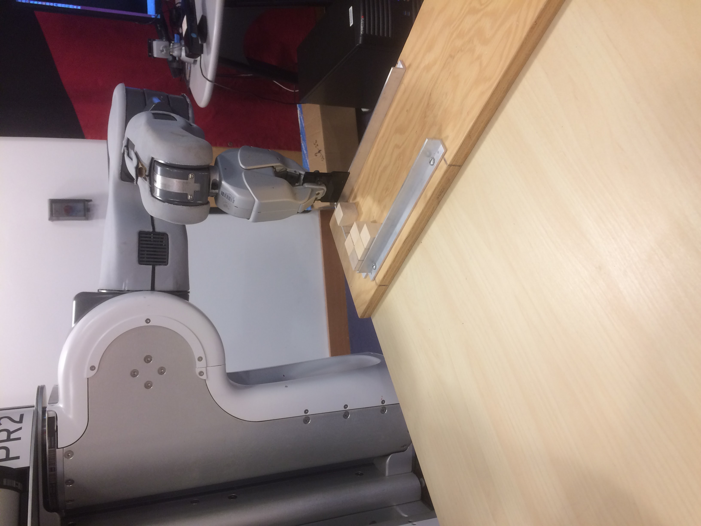
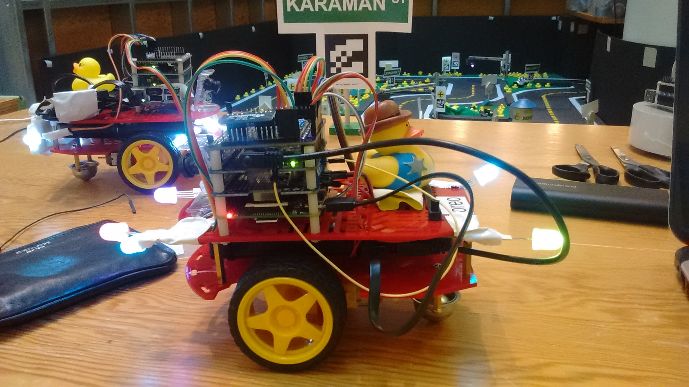

 
<h2> Pictures (mostly featuring robots) </h2>

  

    
    

      
        

        <h5>BeerBots!</h5>
        
Our award winning multi-robot planner that handles uncertainty.

        

    

     

        
    

    

        
    

    

        
    

    

        
    

    

        
    

    

        
    

    

        
    

    

        
    

    

        
    

    

        
    

    

        
    

  

<button class="carousel-control left glyphicon glyphicon-chevron-left" href="#myCarousel" data-slide="prev"> </button>
<button class="carousel-control right glyphicon glyphicon-chevron-right" href="#myCarousel" data-slide="next"> </button>

