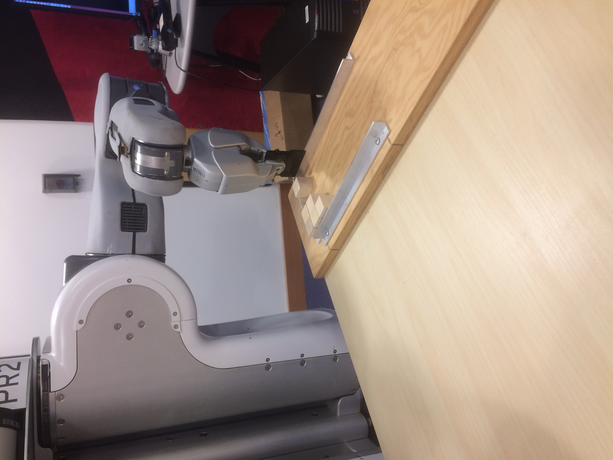
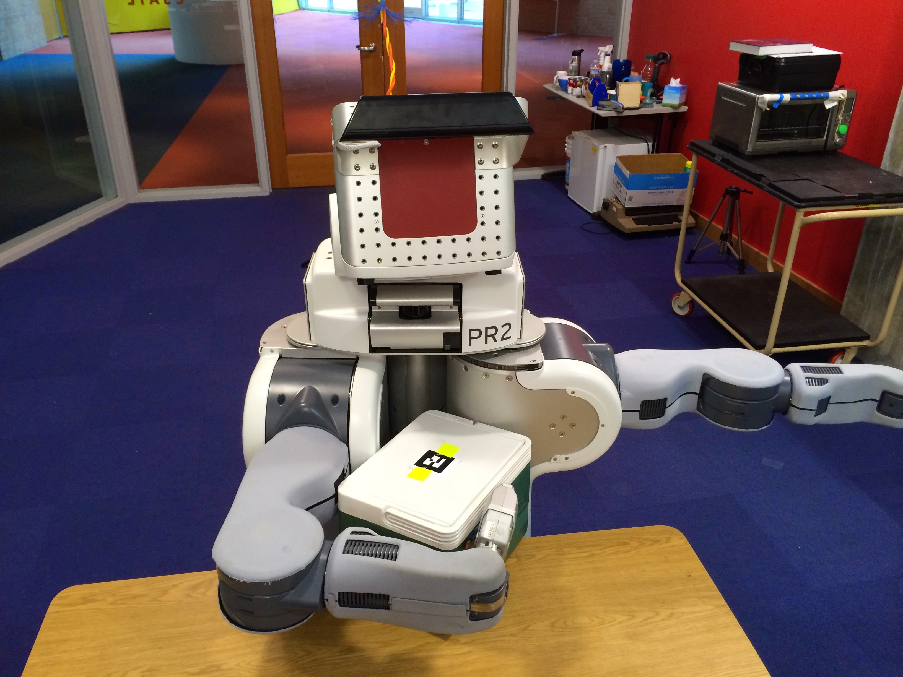
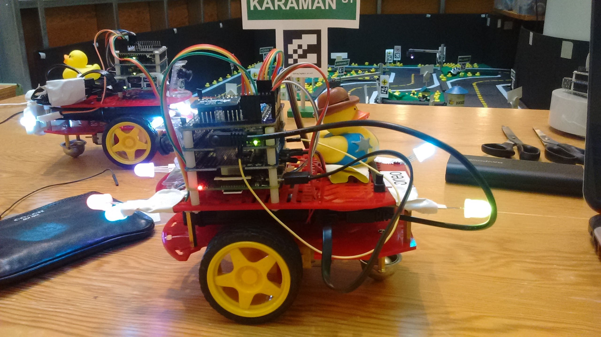
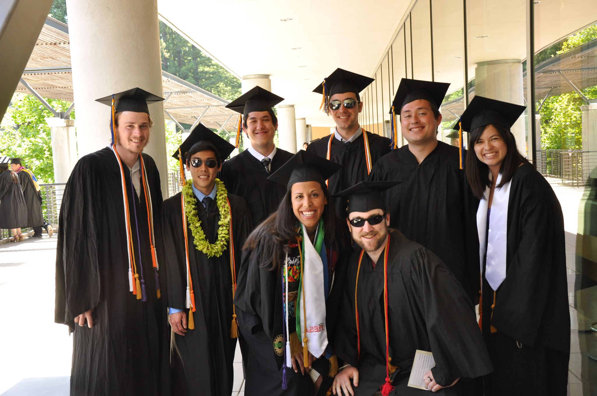
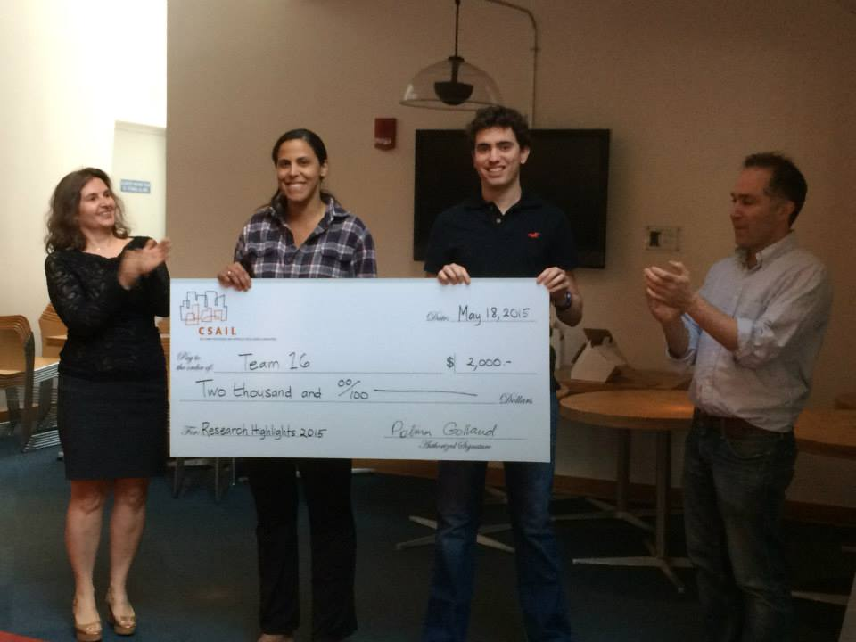
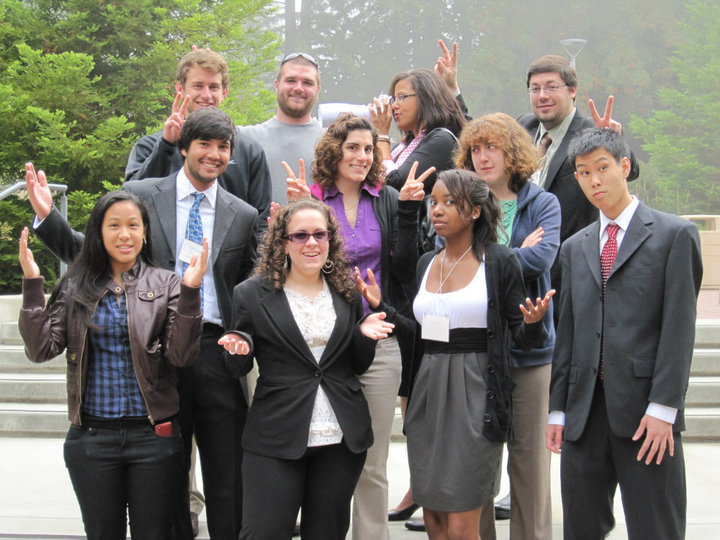
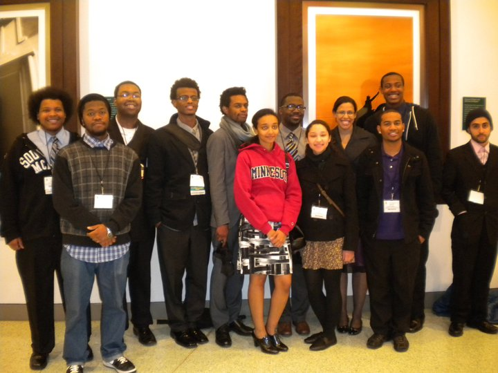
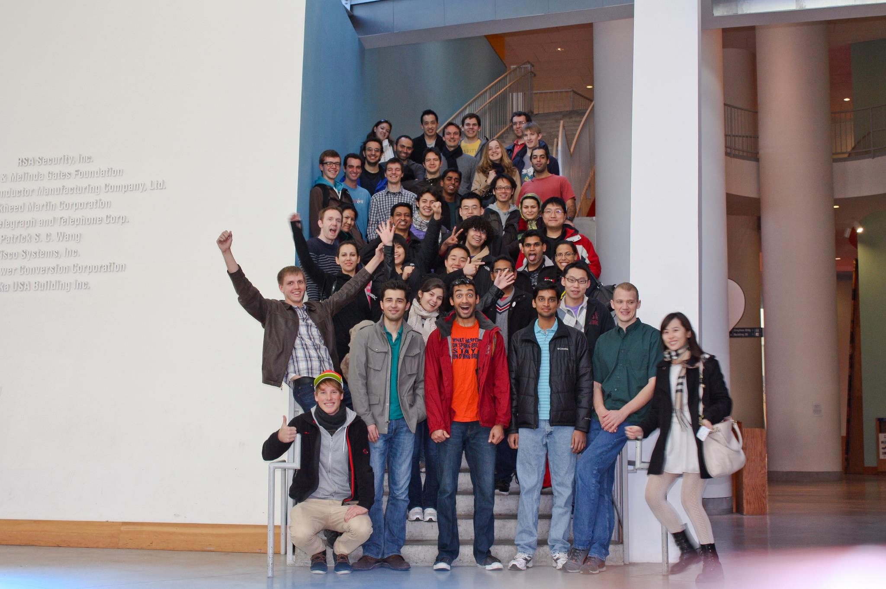

 
<h2> Reliably arranging objects: a conformant planning approach to robot manipulation </h2>

<h4>Abstract</h4> 
A crucial challenge in robotics is achieving reliable results in spite of sensing and control uncertainty. In this work, we explore the conformant planning approach to reliable robot manipulation. In particular, we tackle the problem of pushing multiple planar objects simultaneously to achieve a specified arrangement without using external sensing.  A conformant plan is a sequence of manipulation actions that reliably achieve a goal arrangement in spite of uncertainty in object pose and nondeterministic action outcomes, and without assuming the availability of additional observations. To find conformant plans, we explored two different approaches:

<ul>
<li><em> 1) Conformant planning through plan improvement. </em> This approach takes a deterministic manipulation plan and augments it by adding fixtures (movable obstacles) to push parts up against. This method uses an optimization-based approach to determine the ideal fixture placement location.</li>
<li><em> 2) Conformant planning by construction.</em> This approach reformalizes conformant planning as a belief-state planning problem. A belief state is the set of all possible states of the world, and the objective is to find a sequence of actions that will bring an initial belief state to a goal belief state. To do forward belief-state planning, we created a deterministic belief-state transition model from on-line physics-based simulations and supervised learning based on off-line physics simulations.</li>
</ul>

This thesis provides insight and develops approaches toward scalable methods for solving challenging planar manipulation problems with multiple objects or concave shape geometry.  We show the success of these approaches based on planning times and robustness in real and simulated experiments.

<!--

  

    
    

      
        

        <h5>BeerBots!</h5>
        
Our award winning multi-robot planner that handles uncertainty.

        

    

     

        
    

    
:vs
        
    

    

        
    

    

        
    

    

        
    

    

        
    

    

        
    

    

        
    

    

        
    

    

        
    

    

        
    

  

<button class="carousel-control left glyphicon glyphicon-chevron-left" href="#myCarousel" data-slide="prev"> </button>
<button class="carousel-control right glyphicon glyphicon-chevron-right" href="#myCarousel" data-slide="next"> </button>

-->

