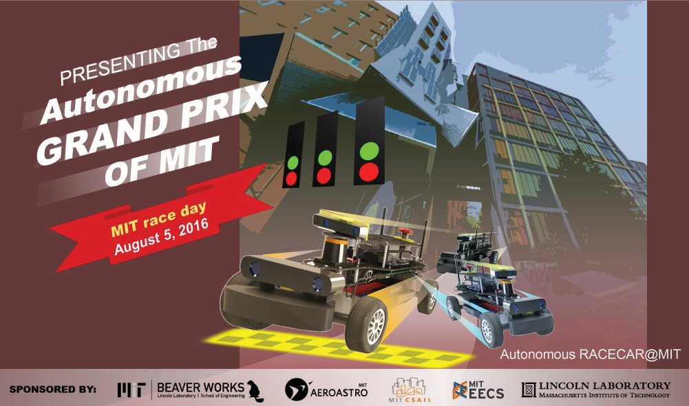
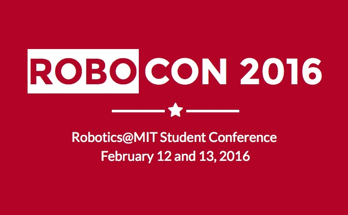

    

        <h1> Projects</h1>
    
As a graduate and undergraduate student studying engineering, I participated in many hands-on projects. Some of these were created from coursework and research. Other projects are motivated by my interested in mental wellness and sustainablity.
    

    

    

        
    

	<a href ="http://arii.github.io/boop/">
    <h3>Boop Light Detector
    </h3>
    </a>
    

    Boop is an an app developed for iOS users to detect levels of light and interpret this information with sound. It allows its blind and visually impaired users to detect whether lights are on or off. It covers a broad range of light levels which span from sensing daylight through open windows to checking whether the indicator light is on for a wifi router.

    
 Boop is offered for free on the iOS store and has been downloaded over 6000 times.
    

    

    

    
    

    <a href ="http://news.mit.edu/2016/stata-center-phone-booths-light-therapy-aims-to-brighten-moods-0729">
    <h3>Light Therapy at MIT 
    </h3>
    </a>
    
I placed public artificial lightboxes around locations on MIT's campus for people with Seasonal Affective Disorder (SAD).  Lightboxes  are large and expensive, making it challenging for students to have consistent access to them.  By placing lightboxes in accessible locations on campus, I hoped to ameliorate some of the effects from the north eastern winter. 

    
This project is funded by the <a href="mindhandheart.mit.edu/">MindHandHeart</a> Innovation Fund.  
    

    

    

    
    

    <a href="https://beaverworks.ll.mit.edu/CMS/bw/bwsi">
    <h3>BeaverWorks Summer Institute
    </h3>
    </a>
    

The MIT Beaver Works Summer Institute is a rigorous, world-class STEM program for talented rising high school seniors. I participated as a RACECAR instructor in 2016 and 2017 as a lead assosciate instructor and technical instructor, respectively.   In the RACECAR course, students programmed small robotic cars to autonomously navigate a racetrack.
    

    
 Some lectures I gave for the course which are available on youtube: <a href="https://www.youtube.com/watch?v=CdRs0l9f5WM">planning lecture</a> and <a href="https://www.youtube.com/watch?v=bAAatB2IvUM">visual servoing lecture </a>. 

    

    

        
    

	<a href ="http://news.mit.edu/2015/csail-delivery-robots-collaborate-0810">
    <h3>Delivery Bots
    </h3>
    </a>
    
My research group worked on a multi-robot project for unpredictable environments.  In this <a href="https://youtu.be/Jfzun9pP74U">video</a>, I give an overview of the project.  
    

    
We presented this work at the Robotics Science and Systems (RSS) conference in 2015.  An abstract and our paper is available <a href="http://www.roboticsproceedings.org/rss11/p07.html">here</a>. This paper was a best paper finalist at the conference and extended, by invitation, for the International Journal of Robotics Research.  

    

    

        
    

    <a href="http://robocon.mit.edu">
    <h3>RoboCon 2016 Webdesigner
    </h3>
    </a>
    
RoboCon is a student workshop for robotics across any department or lab at MIT.  I was a committee chairperson and created the website for the inaugural conference.
    

    

    

        
    

    <a href="https://www.youtube.com/watch?v=f5l8GA1PHm8&t=1s">
    <h3>Drone Line Following Project
    </h3>
    </a>
    
I took 16.31 Feedback and Control Systems, which provided a Rolling Spider Parrot drone for learning the material. For our final project, my group decided to make the drone use its onboard camera to follow a line on the ground. 

    The code for our project is available online at <a href="https://github.com/arii/FollowTheYellowBrickRoad">github.</a>

              

    

        
    

    <a href ="http://dspace.mit.edu/handle/1721.1/91034">
    <h3>Learning SWAG
    </h3>
    </a>
    
 My master's thesis is titled, "Learning a Strategy for Whole Arm Grasping".  In this work, I used reinforcement learning for dynamic whole-arm grasps using single and bimanual manipulation. 
    

    

    

        
    

    <a href="http://leac.mit.edu">
    <h3>Lab Energy Assessment Center
    </h3>
    </a>
    
The Lab Energy Assessment Center (LEAC) is a new organization founded from a grant won from the MIT Green Labs program. The goal of the LEAC is to work in conjunction with Green Labs and MIT Sustainability to promote resourceful energy usage by providing energy assessments free of charge to labs on campus. 
    

    
 As the Lead Technology Developer, I created networking monitoring software to efficiently analyze a lab's energy consumption.

    

